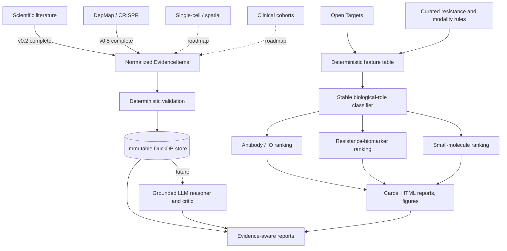
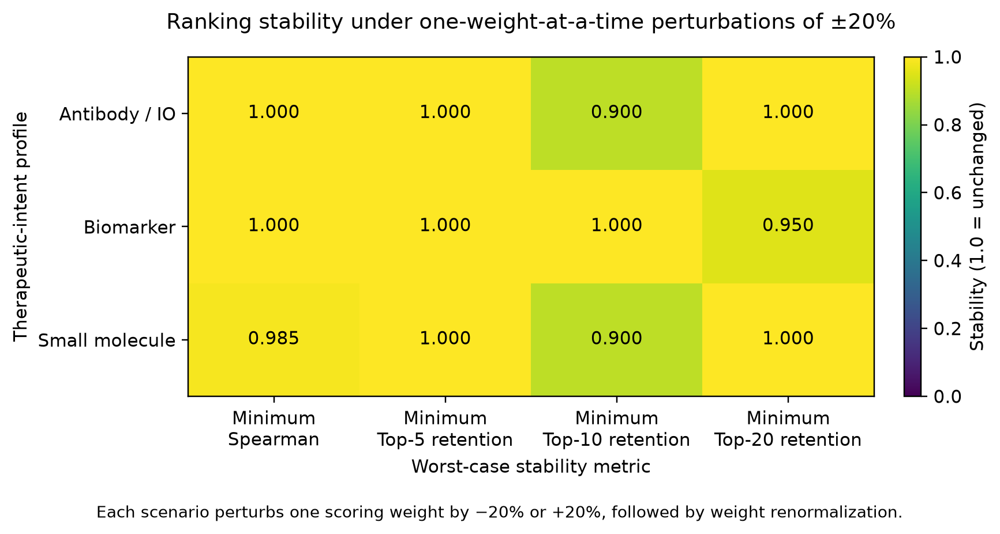

# TargetIntel-IO

[](https://github.com/rsolerortuno/TargetIntel-IO/actions/workflows/tests.yml) [](https://github.com/rsolerortuno/TargetIntel-IO/releases/latest) [](https://www.python.org/) [](LICENSE)

**Explainable, therapeutic-intent-aware target intelligence for anti-PD-1-resistant melanoma.**

TargetIntel-IO is a reproducible scientific software project for classifying, prioritizing, and explaining candidate therapeutic targets and biomarkers. It combines a deterministic translational-biology baseline with an emerging, auditable evidence layer for literature, functional genomics, single-cell, spatial, and clinical-response data.

> **Not simply “What is the best target?” but “Best candidate for which therapeutic intent, supported by which evidence, and with which limitations?”**

## Project status

| Layer | Status | Purpose |
|---|---|---|
| **v0.1.3 deterministic baseline** | Available | Transparent target classification, therapeutic-intent ranking, benchmark evaluation, hypothesis cards, reports, and sensitivity analysis |
| **v0.2.0 Common Evidence Layer** | Complete | Typed contracts, validation, immutable provenance, storage, retrieval, and post-ranking report decoration |
| **v0.3.0 grounded-evidence infrastructure** | Complete | Provider-neutral execution, audited extraction, mandatory review, reviewed snapshots, grounded synthesis, and safe Markdown export |
| **v0.4.0 target feasibility** | Complete | Offline deterministic feasibility retrieval, normalized profiles, coverage reporting, modality composition, and post-ranking presentation |

v0.2.0 is infrastructure and report decoration, not clinical validation or a production LLM extractor. v0.3.0 remains research infrastructure and does not alter deterministic scores, rankings, or role classification.

v0.4.0 adds a separate, descriptive feasibility layer after deterministic prioritization. It can retrieve an explicit directed target universe independently of association rank and report its coverage, while retaining unresolved, no-record, and failed outcomes. Source-linked profiles retain clinical precedence, modality-specific tractability, doability, safety-data state, missingness, and contradictions. Feasibility does not change scores, roles, ranks, ordering, or selection; missing safety data does not mean safety.
Run the fully offline deterministic demonstration:

```bash
python examples/feasibility/run_v040_mock_demo.py --output-dir /tmp/targetintel-v040-demo
```

See the [feasibility example](examples/feasibility/README.md) and [v0.4.0 release notes](docs/releases/v0.4.0.md).

### v0.3.0 evidence-to-synthesis boundary

The original deterministic pipeline still performs target classification and therapeutic-intent scoring. The separate v0.3.0 path moves source-linked observations through provider-neutral extraction, audit, mandatory human review, explicit persistence, immutable reviewed snapshots, and cited target-level synthesis. It creates no score, ranking, role, or treatment recommendation. Human approval permits controlled software promotion only; it is not scientific or clinical validation. Obsidian is an optional rendered destination, never a scientific source of truth.

Run the fully offline synthetic demonstration:

```bash
python examples/llm/run_v030_mock_demo.py --output-dir /tmp/targetintel-v030-demo
```

See the [demo guide](examples/llm/README.md) and [v0.3.0 release notes](docs/releases/v0.3.0.md).

### Version roadmap

v0.2.0 Common Evidence Layer; v0.3.0 Grounded Literature Copilot and provider-agnostic LLM integration; v0.4.0 Target feasibility and expanded Open Targets integration; v0.5.0 DepMap/CRISPR functional dependency; v0.6.0 Single-cell and spatial context; v0.7.0 Clinical-response research model; v0.8.0 De novo target discovery and knowledge graph; v1.0.0 Multitumor target-intelligence platform.

See the [TargetIntel-IO 2.0 roadmap](docs/ROADMAP_2_0.md), the [v0.2.0 evidence-layer specification](docs/specs/v0.2.0_evidence_layer.md), and the [v0.5.0 DepMap release notes](docs/releases/v0.5.0.md).

## Why this project exists

A biologically relevant gene is not automatically a good drug target. The same gene may instead be:

- a direct therapeutic target;
- an anti-PD-1 combination target;
- a resistance biomarker;
- a mechanistic resistance marker;
- a tumor-intrinsic driver;
- an immune-context signal;
- or a poor direct therapeutic candidate.

TargetIntel-IO makes these distinctions explicit and preserves the reasoning behind each classification and ranking rather than returning one opaque score.

## Architecture



### Evidence before interpretation

The LLM is not intended to be the source of truth. Future model-generated interpretations must be derived only from stored, source-linked evidence. TargetIntel-IO separates:

1. retrieved or computed observations;
2. system-generated interpretations;
3. target-level recommendations.

Recommendations must remain traceable to the exact observations, quotations, datasets, cohorts, experiments, and transformations that support them.

## What the deterministic workflow produces

For every candidate, the workflow generates:

- a stable biological and translational role;
- a therapeutic direction;
- matched anti-PD-1 resistance programs;
- modality-fit assessments;
- evidence supporting and arguing against prioritization;
- confidence and uncertainty annotations;
- separate rankings for three therapeutic intents;
- structured Markdown hypothesis cards;
- browsable HTML reports;
- summary figures and rank-shift analyses.

| Mode | Prioritizes |
|---|---|
| **Antibody / IO combination** | Surface-accessible checkpoints, myeloid targets, suppressive immune axes, and combination rationale |
| **Resistance biomarker** | Antigen-presentation loss, IFNγ resistance, immune exclusion, and patient-stratification potential |
| **Small molecule** | Tumor-intrinsic drivers, kinases, oncogenic pathways, and small-molecule tractability |

## Evidence-layer example

```python
EvidenceItem(
    evidence_id="ev_b2m_example",
    target_symbol="B2M",
    disease_name="melanoma",
    disease_id="MONDO:0005105",
    treatment_name="anti-PD-1",
    evidence_type="clinical_cohort",
    evidence_direction="supports_biomarker",
    observation="Source-grounded observation stored separately from interpretation.",
    interpretation=None,
    source="Europe PMC",
    source_id="PMID:...",
    quoted_span="Exact supporting source text.",
    patient_cohort_id="cohort_identifier",
    species="human",
    model_system="patient_tumor_biopsy",
    extraction_method="llm",
    validation_status="citation_verified",
)
```

The evidence layer rejects records that claim verification without the required quotation, support, provenance, identifiers, and validation history. Sharing `source` and `source_id` does not automatically make two observations revisions of one another; revision links are explicit and caller-driven.

## Human-supervised multi-LLM development

Recent v0.2.0 work uses a human-supervised multi-agent development workflow:


Shared agent instructions require the system to:

- never invent biological evidence, numerical values, references, or API data;
- never present association as proof of causality;
- preserve observation separately from LLM interpretation;
- prevent future LLM components from silently changing baseline rankings;
- protect secrets and identifiable patient-level information;
- report unresolved failures explicitly;
- require human approval before publication or merge.

See [`AGENTS.md`](AGENTS.md) and [`CLAUDE.md`](CLAUDE.md).

> Agentic AI currently helps engineer and review the platform. A production
> scientific LLM agent remains a roadmap feature.

## Quick start

### Conda

```bash
git clone https://github.com/rsolerortuno/TargetIntel-IO.git
cd TargetIntel-IO
conda env create -f environment.yml
conda activate targetintel
```

### Pip

```bash
git clone https://github.com/rsolerortuno/TargetIntel-IO.git
cd TargetIntel-IO
python -m venv .venv
source .venv/bin/activate
python -m pip install --upgrade pip
python -m pip install -e ".[dev]"
```

## Run the deterministic workflow

```bash
targetintel run
targetintel run --validate
targetintel run --refresh
targetintel run --help
```

## Main outputs

```text
data/processed/
└── targetintel_feature_table_v0_1.csv

results/
├── ranked_targets.csv
├── target_cards/
├── html_reports/
│   └── index.html
├── figures/
├── benchmark/
└── sensitivity/
```

Versioned examples:

- [`examples/html_reports/`](examples/html_reports/)
- [`examples/figures/`](examples/figures/)
- [`examples/benchmark/`](examples/benchmark/README.md)
- [`examples/sensitivity/`](examples/sensitivity/README.md)

## How the deterministic baseline works

1. **Public evidence retrieval:** melanoma-associated targets are retrieved from
the Open Targets GraphQL API and cached locally.
2. **Feature construction:** targets are annotated with disease association,
resistance-axis membership, modality fit, tractability, known drugs, safety, contradictions, completeness, and confidence.
3. **Stable role classification:** each candidate receives one role independent
of ranking mode.
4. **Therapeutic-intent scoring:** candidates are scored separately for
antibody/IO, biomarker, and small-molecule use.
5. **Human-readable outputs:** rankings are converted into cards, reports,
figures, benchmark summaries, and machine-readable validation outputs.

```text
therapeutic target ≠ biomarker ≠ resistance mechanism ≠ contextual marker
```

## Internal benchmark snapshot

TargetIntel-IO includes a curated 56-target benchmark for internal rule-based sanity validation.

| Metric | Result |
|---|---:|
| Benchmark targets evaluated | 56 / 56 |
| TargetIntel evaluation coverage | 100% |
| Open Targets top-300 retrieval coverage | 44.6% |
| Stable-role accuracy | 100.0% |
| Strict primary-intent accuracy | 91.1% |
| Acceptable-intent accuracy | 100.0% |
| Cross-intent specificity | 90.6% |
| Control not-prioritized rate | 100.0% |
| Mean top-10 recall | 58.1% |
| Mean top-20 recall | 79.5% |

Only **25/56 (44.6%)** benchmark targets appeared among the top 300 melanoma associations retrieved from Open Targets. TargetIntel evaluation coverage therefore does not mean that Open Targets independently recovered every target.

The benchmark produced **100.0% stable-role accuracy**, **91.1% strict primary-intent accuracy**, and **100.0%** acceptable-intent accuracy. Expected roles and acceptable alternatives were internally curated rather than derived from an independent benchmark. These results measure implementation consistency, not independent biological accuracy.

No external patient-level responder/non-responder cohort was used for this internal benchmark. The complete results are available in the [versioned benchmark snapshot](examples/benchmark/README.md).

## Weight sensitivity

The local analysis evaluates **42 scenarios**, changing one scoring weight by `-20%` or `+20%` before renormalization.

Worst-case top-5 retention was: **antibody/IO 100%, biomarker 100%, small-molecule 80%**.

Worst-case top-10 retention was: **antibody/IO 90%, biomarker 100%, small-molecule 90%**.

Worst-case top-20 retention was: **antibody/IO 100%, biomarker 95%, small-molecule 100%**.

The minimum observed Spearman correlation was **0.8762**. The maximum absolute change in strict primary-intent accuracy was **5.36 percentage points**; the maximum acceptable-intent change was **3.57 percentage points**; and the maximum cross-intent-specificity change was **5.66 percentage points**.



This is a local stability analysis. It does not prove that the selected weights are biologically optimal or that the rankings are independent of weight choice.

## Reproducibility and software quality

The project includes:

- a reusable Python package and command-line interface;
- compatible dependency ranges in `pyproject.toml`;
- a Conda environment definition;
- an exact Python 3.11 lockfile with package hashes;
- deterministic ranking and tie-breaking;
- versioned benchmark, sensitivity, and DepMap release-closure evidence;
- GitHub Actions continuous integration;
- offline unit and regression tests;
- immutable evidence storage and Parquet verification;
- scientific and AI-agent safety instructions.

Install the exact locked environment used by CI:

```bash
python -m pip install \
  --require-hashes \
  --requirement requirements-lock.txt

python -m pip install \
  --no-deps \
  --no-build-isolation \
  --editable .
```

Run tests:

```bash
python -m pytest tests -q
```

## Repository map

```text
configs/              Disease context, resistance axes, benchmark, scoring
targetintel/          Reusable Python package and command-line workflow
targetintel/evidence/ Typed evidence contracts, validation, immutable storage
scripts/              Pipeline and snapshot-management commands
tests/                Unit, integration, and regression tests
examples/             Versioned reports, figures, benchmark, sensitivity
docs/                 Architecture, roadmap, evidence-layer specifications
data/                 Local cached and processed data; not versioned
results/              Generated local outputs; not versioned
```

## Scope and limitations

TargetIntel-IO is a hypothesis-generation and target-triage framework. It does not provide clinical recommendations, validated therapeutic targets, qualified biomarkers, causal biological proof, a diagnostic system, patient-level treatment predictions, or medical advice.

The current deterministic implementation focuses on anti-PD-1-resistant melanoma. v0.2.0 evidence reporting remains optional and read-only. v0.5.0 adds reproducible DepMap/CRISPR dependency profiling as an explanatory post-ranking layer: the production baseline remains preserved and candidate activation requires separate human review. Production LLM extraction, single-cell/spatial integration, patient-response modelling, and knowledge-graph inference remain future work.

All generated hypotheses require independent experimental, translational, and clinical validation.

## Data governance

The current workflow uses public data and curated public-domain biological knowledge, principally the Open Targets Platform GraphQL API. No confidential, proprietary, company-internal, or identifiable patient data is included. Generated databases, local caches, and outputs are excluded from version control by default.

## Citation
```text
Soler Ortuño R. TargetIntel-IO: Explainable therapeutic-intent-aware target
intelligence for anti-PD-1-resistant melanoma.
```

## Author
**Rafael Soler Ortuño, PhD**

Computational biologist working across immuno-oncology, biomarker discovery, patient stratification, multi-omics, single-cell and spatial transcriptomics, scientific software engineering, and AI-assisted drug discovery.

[LinkedIn](https://www.linkedin.com/in/rafael-soler-ortuno/)

## License

Released under the [MIT License](LICENSE).
