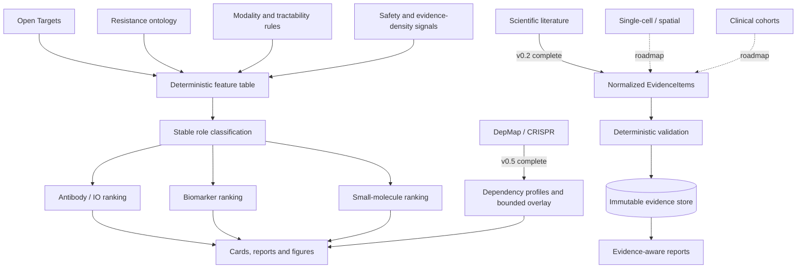

# TargetIntel-IO

[](https://github.com/rsolerortuno/TargetIntel-IO/actions/workflows/tests.yml)
[](https://github.com/rsolerortuno/TargetIntel-IO/releases/latest)
[](https://www.python.org/)
[](LICENSE)

**Explainable, therapeutic-intent-aware target intelligence for anti-PD-1-resistant melanoma.**

TargetIntel-IO is a reproducible scientific software project for classifying, prioritizing, and explaining candidate therapeutic targets and biomarkers. It combines a deterministic translational-biology baseline with auditable evidence layers for literature, target feasibility, functional genomics, and future single-cell, spatial, and clinical-response data.

> **Not simply “What is the best target?” but “Best candidate for which therapeutic intent, supported by which evidence, and with which limitations?”**

## Project status

| Layer | Status | Purpose |
|---|---|---|
| **v0.1.3 deterministic translational baseline** | Complete | Stable role classification, modality reasoning, therapeutic-intent rankings, benchmark and sensitivity analysis |
| **v0.2.0 Common Evidence Layer** | Complete | Immutable evidence contracts, provenance, validation, storage and reporting |
| **v0.3.0 Grounded Literature Copilot and provider-agnostic LLM integration** | Complete architecture and offline demo | Grounded evidence synthesis without changing deterministic rankings |
| **v0.4.0 Target feasibility and expanded Open Targets integration** | Complete | Target feasibility profiles and reproducible Open Targets ingestion |
| **v0.5.0 DepMap/CRISPR functional dependency** | Complete research preview | Reproducible dependency profiling, benchmarking and bounded post-ranking integration |
| **v0.6.0 Single-cell and spatial context** | Roadmap | Cell-state, compartment and spatial-context evidence |
| **v0.7.0 Clinical-response research model** | Roadmap | Research-only response-cohort analysis |
| **v0.8.0 De novo target discovery and knowledge graph** | Roadmap | Evidence-connected discovery and graph reasoning |
| **v1.0.0 Multitumor target-intelligence platform** | Roadmap | Generalized, disease-aware target intelligence |

**Important boundary:** v0.2.0 is infrastructure and report decoration. It is optional, read-only and post-ranking; it cannot silently alter deterministic scores, roles, benchmark outputs or sensitivity results.

A production LLM extractor is not enabled. LLM-assisted workflows remain grounded, provider-agnostic and separated from production ranking decisions.

See the [TargetIntel-IO 2.0 roadmap](docs/ROADMAP_2_0.md), the [v0.2.0 evidence-layer specification](docs/specs/v0.2.0_evidence_layer.md), and the [v0.5.0 DepMap release notes](docs/releases/v0.5.0.md).

## Why this project exists

Public target-discovery resources can retrieve hundreds of disease-associated genes, but association does not automatically imply therapeutic value.

A candidate may be:

- a direct therapeutic target;
- an immunotherapy-combination opportunity;
- a resistance biomarker;
- a patient-stratification marker;
- a mechanistic resistance gene;
- a tumor-intrinsic driver;
- an immune-context marker;
- biologically relevant but poorly tractable;
- or a poor direct target.

TargetIntel-IO separates these interpretations and ranks candidates according to the intended therapeutic use.

## Core design

The framework separates two decisions:

1. **Stable translational role**  
   What kind of biological or therapeutic entity is the candidate?

2. **Therapeutic-intent-aware priority**  
   How useful is the candidate for a particular intervention or biomarker question?

The first implemented ranking profiles are:

- **Antibody / immuno-oncology combination**
- **Resistance biomarker**
- **Tumor-intrinsic / small-molecule intervention**

## Architecture



The deterministic baseline remains authoritative by default. Evidence and functional-dependency layers add auditable context rather than silently replacing the production ranking.

## v0.5.0 real-data release closure

The complete v0.5.0 workflow was executed locally using `DepMap_Public_26Q1`.

### Frozen scope

| Item | Result |
|---|---:|
| Reviewed cutaneous melanoma models | 56 |
| Acral melanoma sensitivity models | 4 |
| Curated benchmark targets | 56 |
| Discovery universe after benchmark union | 331 |
| DepMap background genes | 18,531 |
| Benchmark coverage | 100% |
| Holdout coverage | 100% |
| Differing scientific artifacts across independent runs | 0 |

All required stages completed:

1. full-release ingestion;
2. requested-target ingestion;
3. universe freezing;
4. dependency profiling;
5. benchmark evaluation;
6. bounded integration.

The final state was:

```text
ready_research_preview_human_review
```

The original 300-target antibody/IO baseline remained preserved. Automatic candidate activation remained disabled and any candidate decision requires separate human review.

Two independent persistent runs and their internal replicas were reproducible. The shared scientific closure identity was:

```text
v050closure_e57fa135ff266078d2170bf2a34df094f7888e7ce6002783c75f6a583690a3a4
```

Repository-safe evidence is available in [`docs/releases/evidence/v0.5.0/`](docs/releases/evidence/v0.5.0/).

## Biological context

The first disease context is anti-PD-1-resistant melanoma.

The resistance ontology includes:

- checkpoint redundancy and T-cell exhaustion;
- antigen-presentation loss;
- IFNγ-pathway resistance;
- suppressive myeloid states;
- Treg-mediated suppression;
- TGFβ/CAF-driven exclusion;
- immune-cold states;
- metabolic immune suppression;
- melanoma plasticity and dedifferentiation;
- tumor-intrinsic driver biology.

## Stable role classification

Candidate roles include:

- direct therapeutic target;
- anti-PD-1 combination target;
- resistance biomarker;
- patient-stratification biomarker;
- mechanistic resistance marker;
- tumor-intrinsic driver;
- immune-context marker;
- poor direct therapeutic target;
- unclear or low-confidence candidate.

The classifier explicitly distinguishes:

```text
therapeutic target ≠ biomarker ≠ resistance mechanism ≠ poor direct target
```

## Modality-aware reasoning

The framework evaluates whether a candidate is compatible with:

- antibody or bispecific targeting;
- small-molecule intervention;
- biomarker use;
- patient stratification;
- immunotherapy combination;
- pathway restoration or reprogramming;
- or no credible direct therapeutic modality.

Relevant signals include tractability, localization, known drugs, clinical phase, normal-tissue expression, safety concerns and whether the evidence supports causality or only association.

## Evidence-for and evidence-against

Each target hypothesis records both supporting and opposing evidence.

Supporting evidence may include:

- melanoma association;
- resistance-axis relevance;
- relevant tumor or immune-cell expression;
- surface accessibility;
- known tractability;
- clinical development;
- mechanistic combination rationale;
- intent-specific fit.

Opposing evidence may include:

- intracellular or nuclear localization;
- broad normal-tissue expression;
- essentiality or toxicity risk;
- weak resistance-specific evidence;
- marker-versus-cause ambiguity;
- contradictory findings;
- crowded target space;
- missing or low-confidence evidence.

## Benchmark interpretation

The curated benchmark contains 56 targets spanning checkpoint biology, antigen presentation, IFNγ resistance, myeloid suppression, metabolic suppression, stromal exclusion, melanoma plasticity and tumor-intrinsic drivers.

Only **25/56 (44.6%)** benchmark targets appeared among the top 300 melanoma associations retrieved from Open Targets. TargetIntel evaluation coverage therefore does not mean that Open Targets independently recovered every benchmark target.

The deterministic benchmark evaluates implementation consistency with curated biological expectations. It does not constitute independent clinical validation, prospective predictive performance or proof of therapeutic efficacy.

Complete benchmark outputs are available in [`examples/benchmark/`](examples/benchmark/README.md).

## Weight sensitivity

The local sensitivity workflow evaluates 42 scenarios by changing one scoring weight by `-20%` or `+20%` before renormalization.

The analysis measures ranking stability around the configured baseline. It does not prove that the selected weights are biologically optimal or that rankings are independent of modelling choices.

Complete sensitivity outputs are available in [`examples/sensitivity/`](examples/sensitivity/README.md).

## Evidence layer

The v0.2.0 Common Evidence Layer provides:

- immutable typed evidence records;
- canonical serialization and hashing;
- explicit provenance;
- validation and rejection reasons;
- DuckDB and Parquet storage;
- deterministic read-only reporting;
- source-aware limitations;
- safeguards against score or ranking mutation.

Evidence reporting is optional. The deterministic pipeline can run without it.

## Installation

Create the Conda environment:

```bash
conda env create -f environment.yml
conda activate targetintel
```

For the exact Python 3.11 environment used by continuous integration:

```bash
python -m pip install   --require-hashes   --requirement requirements-lock.txt

python -m pip install   --no-deps   --no-build-isolation   --editable .
```

## Tests

Run the complete test suite before opening or merging a pull request:

```bash
python -m pytest -q
```

Run documentation consistency checks directly:

```bash
python -m pytest tests/test_release_documentation.py -q
```

Check formatting before committing:

```bash
git diff --check
```

GitHub Actions runs the test suite on pushes and pull requests to `main`. Pull requests should only be merged after all required checks pass.

## Repository map

```text
configs/              Disease context, resistance axes, benchmark and scoring
targetintel/          Reusable Python package and command-line workflows
targetintel/evidence/ Typed evidence contracts, validation and storage
scripts/              Pipeline and snapshot-management commands
tests/                Unit, integration, regression and documentation tests
examples/             Versioned reports, figures, benchmark and sensitivity
docs/                 Architecture, roadmap, specifications and release evidence
data/                 Local cached and processed data; not versioned
results/              Generated local outputs; not versioned
```

## Reproducibility and governance

The project includes:

- deterministic ranking and tie-breaking;
- immutable release and configuration identities;
- versioned benchmark and sensitivity snapshots;
- repository-safe release evidence;
- checksum inventories;
- internal replica comparison;
- independent run-to-run comparison;
- continuous integration;
- offline unit and regression tests.

The workflow uses public data and curated public biological knowledge, principally Open Targets Platform and DepMap Public releases.

No confidential, proprietary, company-internal or identifiable patient data is included. Source matrices, generated databases, local caches and complete run directories remain outside version control. Only portable, sanitized evidence, summaries and checksums are committed.

## Scope and limitations

TargetIntel-IO is a hypothesis-generation and target-triage framework. It does not provide:

- clinical recommendations;
- validated therapeutic targets;
- qualified biomarkers;
- causal biological proof;
- patient-level treatment predictions;
- diagnostic decisions;
- medical advice.

DepMap cell-line dependency is contextual functional-genomics evidence, not direct evidence of anti-PD-1 response or clinical efficacy.

The current deterministic implementation focuses on anti-PD-1-resistant melanoma. Single-cell/spatial integration, clinical-response modelling and knowledge-graph inference remain future work.

All generated hypotheses require independent experimental, translational and clinical validation.

## Citation

```text
Soler Ortuño R. TargetIntel-IO: Explainable therapeutic-intent-aware target
intelligence for anti-PD-1-resistant melanoma.
```

## Author

**Rafael Soler Ortuño, PhD**

Computational biologist working across immuno-oncology, biomarker discovery, patient stratification, multi-omics, single-cell and spatial transcriptomics, scientific software engineering and AI-assisted drug discovery.

[LinkedIn](https://www.linkedin.com/in/rafael-soler-ortuno/)

## License

Released under the [MIT License](LICENSE).

## License

Released under the [MIT License](LICENSE).
