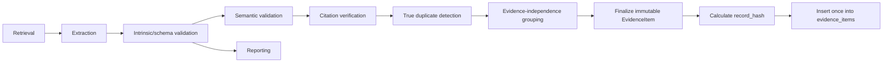
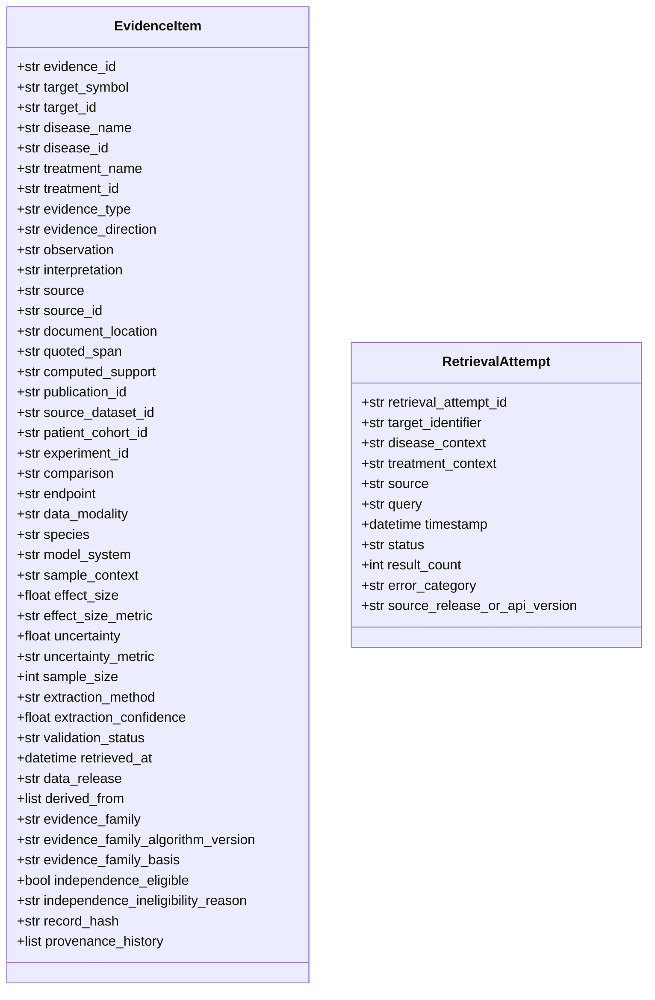
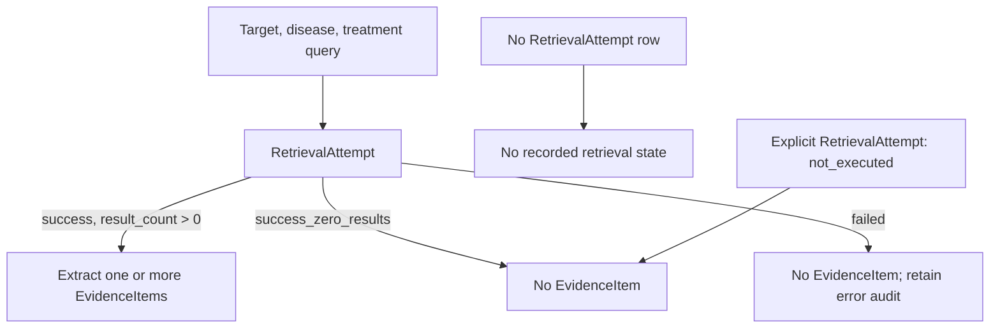
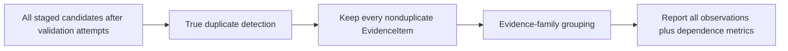

# TargetIntel-IO v0.2.0: Common Evidence Layer Specification (Issue 201)

## Status and purpose

This is a specification-only document for v0.2.0. It defines an auditable common evidence layer for TargetIntel-IO without changing the current deterministic target classification, scoring, benchmark, or ranking workflow. The layer stores observations and their provenance; it does not validate therapeutic targets, make clinical recommendations, establish causality, or qualify biomarkers.

The v0.2.0 implementation uses mock extraction only. No real LLM-generated scientific interpretation or provider-specific model integration is in scope.



Candidates are processed in memory or a non-authoritative staging area. The canonical DuckDB `evidence_items` table is never a mutable workflow-state table. Citation verification precedes normal-report exposure. Each attempted step is captured by append-only provenance events, validation logs, or frozen staging artifacts; a failure is not recast as missing or negative scientific evidence.

## 1. Current-state constraints

The current package obtains melanoma association data in `targetintel/opentargets.py`, builds the feature table in `targetintel/feature_table.py`, applies the stable role classifier in `targetintel/role_classifier.py`, scores in `targetintel/scoring.py`, and ranks in `targetintel/intent_ranking.py`. Current tests exercise those deterministic contracts, including scoring, role classification, benchmark, ranking, and pipeline behavior.

v0.2.0 must preserve the current feature-table columns and deterministic outputs. The following must not be modified by this work or any issue in this specification unless a separate future task explicitly authorizes it:

- `targetintel/scoring.py`
- `targetintel/feature_table.py`
- `targetintel/intent_ranking.py`
- `configs/scoring_*.yaml`
- benchmark labels, including `configs/benchmark_targets.yaml`
- the resistance ontology, including `configs/resistance_axes.yaml`

The evidence layer is not the deterministic role classifier. It must not add a `role_classification` field or vocabulary to `EvidenceItem`, and evidence observations must not dynamically change a deterministic role, therapeutic direction, score, rank, or decision-confidence output.

## 2. Data contract

### 2.1 Identity, source identity, and content integrity

These are distinct concepts:

| Concept | Field | Meaning |
|---|---|---|
| Stable record identifier | `evidence_id` | Immutable identifier assigned when an EvidenceItem is first inserted. It is not a source identifier and is never recomputed to overwrite an existing record. |
| Source identity | `source` + `source_id` | Identifier supplied by the source system, such as a literature record, database row, result object, or dataset object. It may legitimately have multiple EvidenceItems. |
| Content hash | `record_hash` | SHA-256 digest of the canonical content representation used for integrity and exact-content duplicate detection. |
| Evidence family | `evidence_family` | Deterministic, versioned dependence-family identifier used only for independence-aware metrics; it never identifies, deletes, or selects records. |

The content hash is the lowercase hexadecimal SHA-256 of canonical JSON encoded as UTF-8. The canonical JSON is produced with sorted object keys, compact separators `(',', ':')`, explicit `null` values for every optional contract field, and no omitted fields. Before canonicalization, line endings are normalized to LF. Whitespace normalization is limited to trimming leading/trailing whitespace and replacing runs of horizontal whitespace outside `quoted_span` with one space. `quoted_span` is preserved verbatim except for line-ending normalization; its words, punctuation, and internal spaces are not normalized. No case folding, synonym substitution, numeric rounding, identifier rewriting, or other scientific-content transformation is permitted for hashing.

The hash payload includes every finalized EvidenceItem field except `evidence_id`, `record_hash`, and timestamps belonging solely to append-only operational provenance events. It includes `derived_from` in deterministic lexicographic order and includes all frozen provenance content that represents a scientific or extraction change. An implementation must version the canonicalization algorithm in schema metadata.

`record_hash` is not an evidence-family hash. Evidence-family construction is defined in Section 5.2 and is separately versioned by `evidence_family_algorithm_version`.

### 2.1.1 Finalization, insertion, and revisions

The only canonical insertion sequence is **finalize → calculate hash → insert**. Before the hash is calculated, all hash-covered fields must be final, including `validation_status`, `evidence_family`, `evidence_family_basis`, `evidence_family_algorithm_version`, `independence_eligible`, and `independence_ineligibility_reason`. The finalized item is then inserted exactly once. No hashed field may be changed after insertion.

A stored `EvidenceItem` row is immutable. A later scientific or validation change—including successful re-verification, manual curation, corrected extraction, changed provenance, changed evidence-family assignment, or changed validation status—creates a new immutable EvidenceItem revision with a new `evidence_id` and newly calculated `record_hash`. The new version must link to its prior version through `evidence_revisions`, `derived_from`, or another explicit supersession/provenance relation. The prior row remains stored, queryable, and auditable; it must not be updated or overwritten in place.

Insertion behavior is deterministic and non-destructive:

| Condition | Required behavior |
|---|---|
| Exact duplicate content (`record_hash` matches) | Preserve the existing EvidenceItem; create an append-only ingest/audit event referencing it and return the existing `evidence_id`. Do not create a second scientific record, overwrite it, or silently discard the attempt. |
| Same source identity but changed content | Insert a new EvidenceItem with a new `evidence_id` and hash. Link it to the prior item through a revision relation and preserve both records. |
| Revised extraction from the same source | Insert a new immutable revision record, with `derived_from` or an explicit revision link to the prior extraction as applicable; never mutate the prior extraction in place. |
| Actual hash collision (same hash, distinct canonical bytes) | Abort the transaction, retain a collision audit event, and raise a non-retryable integrity error. Never merge or overwrite either record. |

### 2.2 EvidenceItem

An `EvidenceItem` represents one scientifically distinct observation, including supporting, contradictory, and limiting observations. `interpretation` is optional and normally `null` in v0.2.0.



| Field | Type | Requirement | Definition |
|---|---|---|---|
| `evidence_id` | string | required | Stable immutable record identifier. |
| `target_symbol` | string | required | Normalized official target symbol. |
| `target_id` | string/null | optional | Stable target identifier, if available. |
| `disease_name`, `disease_id` | string | required | Human-readable and ontology disease context. |
| `treatment_name`, `treatment_id` | string/null | optional | Treatment context and stable identifier when applicable. |
| `evidence_type`, `evidence_direction` | string | required | Controlled-vocabulary evidence category and direction. |
| `observation` | string | required | Factual source- or computation-grounded observation; not a conclusion or free-text synthesis. |
| `interpretation` | string/null | optional | Normally `null`; individual-item interpretation is not generated by an LLM in v0.2.0. |
| `source`, `source_id` | string | required | Retrieval system and source-system identity. |
| `document_location` | string/null | conditional | Source location such as section, figure, table, result row, or API path when applicable. |
| `quoted_span` | string/null | conditional | Exact source text supporting literature-derived evidence; required for literature evidence and never a paraphrase. |
| `computed_support` | string/null | conditional | Auditable pointer for computed/database-derived evidence: statistic, table, output, query, transformation, or dataset location supporting the observation. |
| `publication_id` | string/null | optional | Publication identifier. |
| `source_dataset_id` | string/null | optional | Dataset identifier supplied by the source. |
| `patient_cohort_id` | string/null | conditional | Patient cohort identity when a cohort is involved. |
| `experiment_id` | string/null | conditional | Specific experimental analysis or assay identity when known. |
| `comparison`, `endpoint` | string/null | conditional | Comparison and measured endpoint when applicable. These remain deliberately free text in v0.2.0; normalization is deferred. |
| `data_modality` | string/null | optional | Modality, such as RNA-seq, CRISPR, WES, protein assay, or structured database assertion. It remains deliberately free text in v0.2.0; normalization is deferred. |
| `species` | string | required | Controlled species value; separate from `model_system`. |
| `model_system` | string | required | Controlled experimental system. |
| `sample_context` | string/null | optional | Tissue, timepoint, cell line, state, or other sample detail. |
| `effect_size`, `effect_size_metric` | number/null, string/null | paired | Numeric result and its metric name (for example `log2_fold_change` or `hazard_ratio`). This specification uses `effect_size_metric` exclusively. |
| `uncertainty`, `uncertainty_metric` | number/null, string/null | paired | Statistical uncertainty value and metric. |
| `sample_size` | integer/null | optional | Positive number of patients, samples, or independent units. |
| `extraction_method` | string | required | Controlled extraction method. |
| `extraction_confidence` | number/null | optional | Extraction-system confidence in [0, 1]; it is not scientific confidence. `null` is allowed when not meaningful, such as a manual record. |
| `validation_status` | string | required | Lifecycle status. |
| `retrieved_at` | datetime | required | Time the source content was retrieved or ingested, represented as timezone-aware UTC datetime and serialized as ISO 8601. |
| `data_release` | string/null | optional | Source release, build, or API version. |
| `derived_from` | list[string] | required | Parent EvidenceItem IDs, empty when not derived. |
| `evidence_family` | string/null | conditional | Deterministic `efam-v1` dependence-family identifier for an independence-eligible record; `null` only when the record is explicitly ineligible because stable provenance is insufficient. It is never a deletion or selection key. |
| `evidence_family_algorithm_version` | string | required | Family algorithm version. In v0.2.0 it is exactly `"efam-v1"`. |
| `evidence_family_basis` | string | required | `patient_cohort_id`, `source_dataset_id`, `experiment_id`, `publication_id`, `stable_source_record`, `composite`, or `ineligible`, as determined by Section 5.2. |
| `independence_eligible` | boolean | required | Whether the record has sufficient stable provenance to participate in independence-family metrics. |
| `independence_ineligibility_reason` | string/null | conditional | Required when `independence_eligible` is false; `null` otherwise. |
| `record_hash` | string | required | Content hash defined above. |
| `provenance_history` | list[ProvenanceStep] | required | Append-only transformation and validation history. |

Every applicable record must retain an auditable support mechanism. Literature evidence uses `quoted_span`; computed/database-derived evidence uses `computed_support`; hybrid evidence may use both. Purely computed evidence does not require `quoted_span`. A manually curated record must also retain the applicable support mechanism, stable source identity, and a provenance step recording the curator identity, review timestamp, review rationale, and the source material or computed output reviewed; manual curation does not substitute for auditable support.

### 2.3 Mock examples

The following are fabricated contract examples, not scientific claims or citations.

```json
{
  "evidence_id": "ev_mock_lit_0001",
  "target_symbol": "MOCK1",
  "target_id": null,
  "disease_name": "melanoma",
  "disease_id": "MONDO:MOCK",
  "treatment_name": "anti-PD-1",
  "treatment_id": null,
  "evidence_type": "clinical_cohort",
  "evidence_direction": "supports_biomarker",
  "observation": "Mock observation extracted from the cited mock document.",
  "interpretation": null,
  "source": "Europe PMC",
  "source_id": "PMID:MOCK1",
  "document_location": "Results, paragraph 2",
  "quoted_span": "Mock source sentence supporting the mock observation.",
  "computed_support": null,
  "publication_id": "PMID:MOCK1",
  "source_dataset_id": "GSE:MOCK1",
  "patient_cohort_id": "mock_cohort_a",
  "experiment_id": "mock_publication_assay_1",
  "comparison": "mock non-responder versus responder",
  "endpoint": "mock response endpoint",
  "data_modality": "RNA-seq",
  "species": "human",
  "model_system": "patient_tumor_biopsy",
  "sample_context": "mock pretreatment biopsy",
  "effect_size": null,
  "effect_size_metric": null,
  "uncertainty": null,
  "uncertainty_metric": null,
  "sample_size": null,
  "extraction_method": "mock",
  "extraction_confidence": 1.0,
  "validation_status": "citation_verified",
  "retrieved_at": "2026-07-12T00:00:00Z",
  "data_release": "mock Europe PMC response v1",
  "derived_from": [],
  "evidence_family": "efam-v1:<sha256 of canonical family key>",
  "evidence_family_algorithm_version": "efam-v1",
  "evidence_family_basis": "patient_cohort_id",
  "independence_eligible": true,
  "independence_ineligibility_reason": null,
  "record_hash": "<sha256 of canonical EvidenceItem content>",
  "provenance_history": []
}
```

```json
{
  "evidence_id": "ev_mock_computed_0001",
  "target_symbol": "MOCK1",
  "target_id": null,
  "disease_name": "melanoma",
  "disease_id": "MONDO:MOCK",
  "treatment_name": null,
  "treatment_id": null,
  "evidence_type": "functional_genomics",
  "evidence_direction": "limits_target",
  "observation": "Mock computed observation from a frozen mock result.",
  "interpretation": null,
  "source": "Mock dependency dataset",
  "source_id": "mock-result-row-17",
  "document_location": "results/mock_dependency.tsv:17",
  "quoted_span": null,
  "computed_support": "dataset=mock_dependency_v1; table=gene_effect; row=17; statistic=mean_gene_effect; transformation=none",
  "publication_id": null,
  "source_dataset_id": "mock_dependency_v1",
  "patient_cohort_id": null,
  "experiment_id": "mock_screen_batch_3",
  "comparison": "mock melanoma versus pan-cancer",
  "endpoint": "gene effect",
  "data_modality": "CRISPR",
  "species": "human",
  "model_system": "cell_line",
  "sample_context": "mock melanoma cell lines",
  "effect_size": -0.5,
  "effect_size_metric": "mean_gene_effect",
  "uncertainty": null,
  "uncertainty_metric": null,
  "sample_size": 3,
  "extraction_method": "computed",
  "extraction_confidence": null,
  "validation_status": "citation_unverified",
  "retrieved_at": "2026-07-12T00:00:00Z",
  "data_release": "mock_dependency_v1",
  "derived_from": [],
  "evidence_family": "efam-v1:<sha256 of canonical family key>",
  "evidence_family_algorithm_version": "efam-v1",
  "evidence_family_basis": "source_dataset_id",
  "independence_eligible": true,
  "independence_ineligibility_reason": null,
  "record_hash": "<sha256 of canonical EvidenceItem content>",
  "provenance_history": []
}
```

## 3. Controlled vocabularies and lifecycle

### Evidence fields

| Field | Allowed values |
|---|---|
| `evidence_type` | `clinical_cohort`, `in_vivo_model`, `in_vitro_model`, `genetic_association`, `functional_genomics`, `expression_profiling`, `tractability`, `safety_signal`, `known_drug`, `database_assertion` |
| `evidence_direction` | `supports_target`, `supports_biomarker`, `contradicts_target`, `limits_target`, `neutral` |
| `species` | `human`, `mouse`, `rat`, `zebrafish`, `non_human_primate`, `other`, `not_applicable`, `unknown` |
| `model_system` | `patient_tumor_biopsy`, `patient_derived_xenograft`, `cell_line`, `organoid`, `co_culture`, `syngeneic_mouse_model`, `in_silico`, `database`, `other`, `unknown` |
| `extraction_method` | `manual`, `llm`, `rule_based`, `database_import`, `computed`, `mock` |
| `validation_status` | Staging-only: `extracted`, `schema_verified`, `semantic_verified`; finalized canonical: `citation_verified`, `manually_curated`, `citation_unverified`, `rejected` |

`species` describes organism and `model_system` describes the experiment or analytical system; neither substitutes for the other. The vocabulary deliberately contains no deterministic `role_classification` values.

### Validation, finalization, and report visibility lifecycle

The workflow is staging-only until the complete pipeline has been attempted:

`retrieval → extraction → intrinsic validation → semantic validation → citation verification → true duplicate detection → evidence-family assignment`.

`extracted`, `schema_verified`, and `semantic_verified` describe intermediate staging transitions only. They must be recorded through append-only provenance events, validation logs, or frozen staging artifacts, and must not be inserted into `evidence_items` as mutable or partially finalized rows. Likewise, attempts at schema, semantic, and citation verification are append-only audit events rather than in-place status updates.

After the full pipeline is attempted and duplicate/family decisions are made, a candidate has one final status:

1. `citation_verified`: required literature verification passed; eligible for normal evidence cards.
2. `manually_curated`: manual review completed with required review provenance and support; eligible for normal evidence cards.
3. `citation_unverified`: the full pipeline was attempted but verification did not establish normal-report eligibility; it may be inserted only as a finalized immutable audit record and must be visibly labeled **Unverified evidence** and excluded from normal evidence cards.
4. `rejected`: the candidate completed attempted processing and has a complete canonical contract, but its final validation outcome is rejection; it may be retained only as a finalized immutable audit record and is excluded from evidence cards and scientific aggregation.

A candidate that fails before canonical finalization must not be inserted as if it were verified evidence. If the implementation persists a finalized unverified or rejected audit record, it must have its final status, completed attempted-processing provenance, final family fields or explicit ineligibility fields, and its hash before its one-time insertion. Normal evidence cards may include only `citation_verified` and `manually_curated` records. Audit views may include only finalized `citation_unverified` or `rejected` records with the visible **Unverified evidence** label; they must never portray staging artifacts or unverified records as verified scientific evidence.

## 4. Retrieval audit trail

Retrieval attempts and evidence observations are different entities. `RetrievalAttempt` is a separate append-only audit entity and may be inserted immediately after an attempt; it is not subject to the EvidenceItem finalization, hashing, or canonical-insertion rule. A target with no returned records must not receive an empty EvidenceItem.



### RetrievalAttempt contract

| Field | Type | Requirement |
|---|---|---|
| `retrieval_attempt_id` | string | required stable attempt identifier |
| `target_identifier` | string | required target symbol or stable target ID used in the request |
| `disease_context` | string | required disease request context |
| `treatment_context` | string/null | treatment request context |
| `source` | string | required source system |
| `query` | string | required exact submitted query |
| `timestamp` | datetime | required timezone-aware UTC request timestamp |
| `status` | enum | required: `not_executed`, `success`, `success_zero_results`, or `failed` |
| `result_count` | integer/null | `0` for `success_zero_results`; non-negative for `success`; null for `not_executed` and normally null for `failed` |
| `error_category` | string/null | required and non-empty when `status = failed`; null otherwise, except an explicit `not_executed` reason may be retained separately |
| `source_release_or_api_version` | string/null | source release, API version, or null when unavailable |

An absent `RetrievalAttempt` row means no retrieval state was recorded; it is distinct from an explicit `not_executed` row and must not be inferred to mean `not_executed`. `not_executed` records a deliberately scheduled or observed non-execution, not a failed request. `success_zero_results` means the executed query completed and returned zero results. `failed` means retrieval could not produce a reliable result, with a categorized error; intrinsic validation rejects a failed attempt without `error_category`. **Missing evidence** is an epistemic state after an adequately scoped successful retrieval and review; it is not represented by an empty EvidenceItem. **Negative scientific evidence** is an actual observation with an appropriate `evidence_direction`, support mechanism, and provenance; it is not the same as zero results, failure, or missing evidence.

## 5. Evidence lineage, duplicate detection, and independence

### 5.1 Required provenance dimensions

The following dimensions are independent and must be preserved whenever known: `publication_id`, `source_dataset_id`, `patient_cohort_id`, `experiment_id`, `comparison`, `endpoint`, `data_modality`, `model_system`, `derived_from`, and `evidence_family`.

One publication can report multiple experiments. One patient cohort can produce multiple analyses. Shared publication or cohort identifiers therefore do not prove that observations are duplicates or independent analyses.

### 5.2 Deterministic evidence-family construction (`efam-v1`)

Every EvidenceItem has `evidence_family_algorithm_version = "efam-v1"`. Family assignment is deterministic, versioned, and conservative: analyses derived from the same patient cohort or source dataset must not be counted as independent merely because they have different experiments, publications, observations, or directions.

For a non-derived root record, select the first available, valid family origin in exactly this precedence order:

1. `patient_cohort_id`
2. `source_dataset_id`
3. `experiment_id`
4. `publication_id`
5. stable source record identity

The selected field name is `evidence_family_basis`; its value is `family_origin_id`. For item fields, stable source record identity is the ordered pair `source_name` + `source_record_id`, where `source_name` is `source` and `source_record_id` is `source_id`; encode the pair as a JSON object, not as an ambiguously concatenated string. An origin is valid only when present, non-empty after trimming, and not a generic placeholder. After trimming and ASCII case folding only for this validity check, the invalid-placeholder set is exactly `unknown`, `none`, `missing`, `null`, `n/a`, `na`, `not_applicable`, `not available`, and `unspecified`; implementations must not convert one of these values into a valid family by formatting or normalization.

For an eligible non-derived root record, construct the canonical family-key object:

```json
{
  "algorithm_version": "efam-v1",
  "target_id": "<target_id or null>",
  "disease_id": "<disease_id>",
  "treatment_id": "<treatment_id or null>",
  "family_basis": "<selected basis>",
  "family_origin_id": "<selected origin ID or source-identity object>"
}
```

`evidence_family` is exactly `"efam-v1:" + SHA-256(canonical JSON family key)`, using the lowercase hexadecimal digest. The canonical family JSON uses the same rules as Section 2.1: UTF-8, sorted keys, compact separators, explicit `null` handling, and normalized line endings. The key must contain no additional fields. In particular, it must not include `observation`, `quoted_span`, `evidence_direction`, `validation_status`, `extraction_confidence`, or `retrieved_at`.

If `patient_cohort_id`, `source_dataset_id`, `experiment_id`, and `publication_id` are all absent or invalid, the stable `source_name` + `source_record_id` pair is the required fallback. If that fallback is also absent, unstable, or generic, the otherwise valid record may be stored with `evidence_family = null`, `evidence_family_basis = "ineligible"`, `independence_eligible = false`, and a non-empty `independence_ineligibility_reason`; it is excluded from independence-family metrics. It must still remain a separate, preserved EvidenceItem and may participate in other appropriate record-level reporting.

For a derived record, resolve its root ancestors by recursively following `derived_from` to records with no parents. If all root ancestors belong to the same non-null `evidence_family`, the derived record inherits that root `evidence_family` and its root family basis. If its roots span multiple independent non-null families, assign `evidence_family_basis = "composite"` and construct a composite family key whose `family_origin_id` is a deterministically lexicographically sorted list of root family IDs; all other family-key fields retain the derived record's `algorithm_version`, `target_id`, `disease_id`, and `treatment_id`. Generate its `evidence_family` with the same `efam-v1` formula. A composite derived record is not an additional independent family beyond its root families and must contribute zero additional families to independence-aware metrics. If any root is ineligible or its family cannot be resolved, the derived record is ineligible unless an implementation can prove that all roots resolve to one same non-null family.

### 5.3 Separate operations



- **Duplicate detection** identifies genuinely duplicated extractions only.
- **Evidence-family grouping** estimates dependence and supports independence-aware counts.
- **Reporting** preserves every scientifically distinct observation.
- Supporting, contradictory, and limiting records remain separate EvidenceItems even if they share a publication, cohort, experiment, dataset, or model system.

There is no "choose one representative per evidence family" operation. `evidence_family` must never be used as a unique key, deletion key, or report filter.

### 5.4 True duplicate rule

An item is a true duplicate only when there is strong agreement on all applicable dimensions: same source identity; same evidence direction; same document location; same or near-identical `quoted_span`; same or near-identical observation; and compatible publication, experiment, dataset, and cohort identifiers. For computed evidence, `computed_support` replaces `quoted_span` in the comparison. Compatibility means identifiers match when both are populated; a missing identifier does not by itself establish duplication.

Near-identical matching is only a deterministic candidate flag. Before marking a duplicate, the implementation must retain the match rationale and require all non-text identity checks above. Records that merely share an evidence family, publication, patient cohort, experiment, target, model system, or topic are not duplicates.

Derived records retain parent links in `derived_from`. A semantic validator rejects dangling parents and cycles. Dependence-aware summaries must state their counting level (records, publications, experiments, cohorts, or evidence families), exclude ineligible records from family counts, count composites only through their root families, and must not call a count "independent" when required provenance is missing.

## 6. Storage, snapshots, and migration

DuckDB is the operational source of truth for finalized immutable evidence records, retrieval attempts, relationships, and audit history. `evidence_items` receives only terminal, finalized versions and is not a mutable workflow-state table; staging is in memory or a non-authoritative staging area. `retrieval_attempts`, provenance events, validation logs, revision links, and ingest audit events are append-only. Parquet files are immutable derived snapshots or exports from DuckDB. Parquet is not an independently editable competing source of truth.

`data/` remains normally uncommitted. A committed example snapshot is allowed only under `examples/evidence/`, must be a deliberately tiny mock fixture (maximum 1 MiB), must document its schema version and test/demo purpose in that directory, and must not contain local caches, raw production retrievals, or patient-level data.

```text
data/evidence/
├── evidence.duckdb              # local operational source of truth; normally uncommitted
└── snapshots/                   # immutable derived exports; normally uncommitted
    └── evidence-v0.2.0.parquet
examples/evidence/               # optional committed mock fixture only, <= 1 MiB
```

### 6.1 DuckDB tables

```sql
CREATE TABLE evidence_items (
    evidence_id VARCHAR PRIMARY KEY,
    target_symbol VARCHAR NOT NULL,
    target_id VARCHAR,
    disease_name VARCHAR NOT NULL,
    disease_id VARCHAR NOT NULL,
    treatment_name VARCHAR,
    treatment_id VARCHAR,
    evidence_type VARCHAR NOT NULL,
    evidence_direction VARCHAR NOT NULL,
    observation TEXT NOT NULL,
    interpretation TEXT,
    source VARCHAR NOT NULL,
    source_id VARCHAR NOT NULL,
    document_location VARCHAR,
    quoted_span TEXT,
    computed_support TEXT,
    publication_id VARCHAR,
    source_dataset_id VARCHAR,
    patient_cohort_id VARCHAR,
    experiment_id VARCHAR,
    comparison TEXT,
    endpoint TEXT,
    data_modality VARCHAR,
    species VARCHAR NOT NULL,
    model_system VARCHAR NOT NULL,
    sample_context TEXT,
    effect_size DOUBLE,
    effect_size_metric VARCHAR,
    uncertainty DOUBLE,
    uncertainty_metric VARCHAR,
    sample_size INTEGER,
    extraction_method VARCHAR NOT NULL,
    extraction_confidence DOUBLE,
    validation_status VARCHAR NOT NULL,
    retrieved_at TIMESTAMP WITH TIME ZONE NOT NULL,
    data_release VARCHAR,
    evidence_family VARCHAR,
    evidence_family_algorithm_version VARCHAR NOT NULL,
    evidence_family_basis VARCHAR NOT NULL,
    independence_eligible BOOLEAN NOT NULL,
    independence_ineligibility_reason TEXT,
    record_hash VARCHAR NOT NULL UNIQUE
);

CREATE TABLE retrieval_attempts (
    retrieval_attempt_id VARCHAR PRIMARY KEY,
    target_identifier VARCHAR NOT NULL,
    disease_context VARCHAR NOT NULL,
    treatment_context VARCHAR,
    source VARCHAR NOT NULL,
    query TEXT NOT NULL,
    timestamp TIMESTAMP WITH TIME ZONE NOT NULL,
    status VARCHAR NOT NULL,
    result_count INTEGER,
    error_category VARCHAR,
    source_release_or_api_version VARCHAR
);

CREATE TABLE provenance_steps (
    evidence_id VARCHAR NOT NULL REFERENCES evidence_items(evidence_id),
    step_index INTEGER NOT NULL,
    step_name VARCHAR NOT NULL,
    operator VARCHAR NOT NULL,
    timestamp TIMESTAMP WITH TIME ZONE NOT NULL,
    metadata_json TEXT NOT NULL,
    PRIMARY KEY (evidence_id, step_index)
);

CREATE TABLE derived_links (
    child_id VARCHAR NOT NULL REFERENCES evidence_items(evidence_id),
    parent_id VARCHAR NOT NULL REFERENCES evidence_items(evidence_id),
    PRIMARY KEY (child_id, parent_id)
);

CREATE TABLE evidence_revisions (
    newer_evidence_id VARCHAR NOT NULL REFERENCES evidence_items(evidence_id),
    prior_evidence_id VARCHAR NOT NULL REFERENCES evidence_items(evidence_id),
    reason VARCHAR NOT NULL,
    PRIMARY KEY (newer_evidence_id, prior_evidence_id)
);

CREATE TABLE ingest_audit_events (
    event_id VARCHAR PRIMARY KEY,
    timestamp TIMESTAMP WITH TIME ZONE NOT NULL,
    event_type VARCHAR NOT NULL,
    submitted_hash VARCHAR,
    evidence_id VARCHAR,
    details_json TEXT NOT NULL
);

CREATE TABLE schema_metadata (
    schema_version VARCHAR PRIMARY KEY,
    canonicalization_version VARCHAR NOT NULL,
    updated_at TIMESTAMP WITH TIME ZONE NOT NULL
);
```

Indexes must support target, source identity, validation status, evidence family, and provenance dimensions without imposing uniqueness beyond `evidence_id` and exact `record_hash`:

```sql
CREATE INDEX idx_evidence_target ON evidence_items(target_symbol);
CREATE INDEX idx_evidence_source ON evidence_items(source, source_id);
CREATE INDEX idx_evidence_status ON evidence_items(validation_status);
CREATE INDEX idx_evidence_family ON evidence_items(evidence_family);
CREATE INDEX idx_evidence_independence_eligible ON evidence_items(independence_eligible);
CREATE INDEX idx_evidence_experiment ON evidence_items(experiment_id);
CREATE INDEX idx_retrieval_target ON retrieval_attempts(target_identifier);
```

The storage implementation must reject `UPDATE` or overwrite operations on `evidence_items`, especially for hash-covered fields. It may only insert a finalized row, retrieve rows, append provenance/audit/revision records, and export snapshots. Migrations are explicit and versioned. They preserve source records and audit history. If an LLM extractor is introduced later, migrations must replay frozen extracted JSON records; they must not silently re-run a potentially changed model, prompt, provider, or retrieval query.

## 7. Interfaces and processing responsibilities

The proposed package remains isolated in `targetintel/evidence/`:

```text
targetintel/evidence/
├── models.py          # EvidenceItem, RetrievalAttempt, ProvenanceStep, serialization, hashing
├── validation.py      # intrinsic and semantic validation
├── store.py           # DuckDB source of truth and Parquet export
├── retriever.py       # Europe PMC query builder and retrieval-attempt recording
├── extractor.py       # extractor protocol and mock extractor
├── verifier.py        # citation/document/quote verification
├── duplicates.py      # true duplicate candidate and decision logic
├── independence.py    # family grouping and independence metrics
└── reporting.py       # explicitly filtered evidence-card decoration
```

Representative contracts:

```python
class EvidenceValidator:
    def validate_intrinsic(self, item: EvidenceItem) -> list[ValidationIssue]: ...
    def validate_semantic(self, item: EvidenceItem, store: EvidenceStore) -> list[ValidationIssue]: ...

class EvidenceStore:
    def insert_finalized_item(self, item: EvidenceItem) -> InsertResult: ...
    def get_item(self, evidence_id: str) -> EvidenceItem | None: ...
    def link_revision(self, newer_evidence_id: str, prior_evidence_id: str, reason: str) -> None: ...
    def record_provenance_event(self, event: ProvenanceEvent) -> None: ...
    def record_retrieval_attempt(self, attempt: RetrievalAttempt) -> None: ...
    def export_snapshot(self, output_path: Path) -> None: ...

class EuropePMCRetriever:
    def search(self, request: RetrievalRequest) -> RetrievalAttempt: ...

class Extractor(Protocol):
    def extract(self, document: SourceDocument) -> list[EvidenceItem]: ...

class MockExtractor:
    """Deterministic v0.2.0 fixture extractor; no LLM call."""

class CitationVerifier:
    def verify(self, item: EvidenceItem, document: SourceDocument) -> VerificationResult: ...

class TrueDuplicateDetector:
    def assess(self, candidate: EvidenceItem, existing: Sequence[EvidenceItem]) -> DuplicateDecision: ...

class EvidenceIndependenceGrouper:
    def assign_family(self, item: EvidenceItem, store: EvidenceStore) -> EvidenceItem: ...
    def group(self, items: Sequence[EvidenceItem]) -> Mapping[str, list[EvidenceItem]]: ...
    def independent_family_ids(self, items: Sequence[EvidenceItem]) -> set[str]: ...

class EvidenceReportDecorator:
    def normal_card_items(self, items: Sequence[EvidenceItem]) -> list[EvidenceItem]: ...
```

Processing responsibility is fixed:

1. Retriever records a `RetrievalAttempt` for every requested search immediately after the attempt and returns source documents only on successful retrieval.
2. Extractor emits raw staging candidates and does not assign scientific certainty.
3. Intrinsic validation and semantic validation record append-only attempted outcomes in staging/audit history.
4. Citation verifier records its attempted outcome and, for literature, checks identifiers, retrieved document identity, document location where available, and literal `quoted_span` containment before a final `citation_verified` status is allowed.
5. True duplicate detection prevents only genuine repeated extraction from becoming a second scientific record.
6. Independence grouping assigns `efam-v1` family fields or explicit ineligibility before finalization.
7. The finalizer completes all hash-covered fields, calculates `record_hash`, and calls `insert_finalized_item` exactly once. The store rejects incomplete or non-finalized candidates and exposes no in-place update operation for hashed EvidenceItem fields.
8. Reporting retrieves stored finalized records only; it does not mutate validation or family fields, and exposes normal evidence cards only after the specified status filter.

## 8. Validation layers and required tests

### Issue 202: intrinsic validation

Intrinsic validation is deterministic and does not make a scientific or translational judgement. It verifies:

- required fields and field types;
- enum membership;
- positive `sample_size` where present;
- `extraction_confidence` in [0, 1] where present;
- deterministic stable-ID, canonical serialization, and hash behavior;
- `evidence_family_algorithm_version = "efam-v1"`, valid family-basis membership, and the required ineligible-record marker fields;
- `failed` RetrievalAttempts have a non-empty `error_category`.
- serialization round trips for datetimes, null values, lists, and provenance history.

### Issue 203: semantic and cross-field validation

Semantic validation verifies:

- literature evidence requires non-empty exact `quoted_span` and an auditable document location where available;
- computed or database-derived evidence requires non-empty `computed_support` when it makes a computed/database observation;
- `citation_verified` requires successful citation verification evidence in provenance;
- derived records reference valid parents and do not form cycles;
- family fields are internally consistent: eligible records have a non-null family and valid basis, while ineligible records have `family_basis = "ineligible"`, a null family, and a reason; derived records have valid roots;
- patient-cohort or experiment context is present where required by `evidence_type`, `model_system`, comparison, endpoint, or source metadata;
- paired effect-size and uncertainty fields are internally consistent;
- observation and interpretation are stored separately, and v0.2.0 mock extraction leaves `interpretation` null;
- no status transition skips required validation or citation verification.
- manually curated records retain auditable support, stable source identity, and curator review provenance.

### Acceptance tests across the layer

- A literature record without `quoted_span` fails semantic validation; a purely computed record with `quoted_span: null` and valid `computed_support` passes that rule.
- A citation-verified literature record whose quoted span does not occur literally in the retrieved document cannot reach `citation_verified`.
- A publication containing two experiment IDs produces two preserved EvidenceItems and does not imply two independent publications.
- Supporting, contradictory, and limiting observations sharing a cohort or family remain three EvidenceItems.
- Records sharing an evidence family but differing in direction, location, quoted span, or observation are not deduplicated.
- Two records with the same valid `patient_cohort_id` but different datasets, experiments, publications, or directions receive the same `efam-v1` family; the cohort takes precedence.
- When cohort is absent, dataset, experiment, publication, then stable source identity are selected in that exact order. `unknown`, `none`, and `missing` do not satisfy any origin; a record without a valid fallback is stored as explicitly ineligible and excluded from independence metrics.
- A derived record with roots in one family inherits it; a record integrating multiple root families has `family_basis = "composite"`, uses a sorted root-family-ID list in its key, and adds no independent family beyond those roots.
- Family-key canonicalization is reproducible using UTF-8, sorted keys, compact separators, explicit nulls, and LF line endings; changing observation, quote, direction, validation status, extraction confidence, or retrieval time does not change the family.
- Exact same-content insertion returns the existing ID and writes an audit event; changed same-source content creates a revision; collision bytes abort.
- `record_hash` is calculated only after final `validation_status` and all evidence-family and eligibility fields are assigned; canonical insertion rejects any item missing those finalization fields.
- A stored EvidenceItem's hashed fields cannot be updated in place. A content, provenance, family, or status change creates a new immutable revision with a new ID and hash; the prior revision remains queryable.
- A finalized `citation_unverified` or `rejected` audit record has completed the attempted pipeline and is excluded from normal verified evidence cards; a failed staging candidate is never shown as verified evidence.
- A RetrievalAttempt can be recorded independently of EvidenceItem insertion, including when no candidate reaches finalization.
- `success_zero_results`, `failed`, explicit `not_executed`, and an absent RetrievalAttempt row remain distinguishable in storage and reports; `failed` without `error_category` is invalid, and none creates an empty EvidenceItem.
- A manually curated record lacking auditable support, stable source identity, or curator review provenance cannot reach `manually_curated`.
- Staging-only `extracted`, `schema_verified`, and `semantic_verified` artifacts are not retrievable from canonical evidence cards; an audit view may show only finalized `citation_unverified` or `rejected` records with an explicit **Unverified evidence** label.
- Altering only `extraction_confidence` cannot directly change evidence strength, target relevance, therapeutic role, target score, ranking, or decision confidence. Regression tests must hold the deterministic feature table and all scored/ranked outputs byte-identical before and after evidence-layer operation. Reports display this field only as **Extraction confidence**; when a future LLM method is used, **LLM extraction confidence** is allowed. The generic label “confidence” is forbidden for this field.

## 9. Reporting and interpretation scope

Evidence cards may show deterministic record counts, citations/provenance, quoted spans or computed support, contradictions, limitations, evidence-family membership, and explicit independence metrics. They must preserve the distinction between record count and counts of known publication, experiment, and patient-cohort identities.

For v0.2.0, `EvidenceItem.interpretation` is optional and normally null. No real LLM-generated interpretation is implemented. Target-level free-text scientific synthesis is out of scope. A future target-level interpretation must be stored as a separate object, linked to the specific supporting EvidenceItem IDs, with its own provenance and validation; it must not be inserted into individual evidence observations.

## 10. Backward compatibility and exclusions

The evidence store is optional and report-only in v0.2.0. It runs after the existing deterministic prioritization has completed and cannot supply a scoring feature, mutate a feature, or alter ranking inputs. The regression gate compares existing scores, classifications, and rankings with and without evidence-layer reporting and requires them to remain unchanged.

Out of scope: production LLM providers; target-level LLM synthesis; DepMap or other production-scale data ingestion; single-cell/spatial computation; patient-response modeling; knowledge graphs; changes to scoring or scientific configuration; and clinical or biological validation claims.

## 11. Implementation sequence

Each issue is sequential. Allowed paths are the only paths intended for that issue, except minimal package initialization imports where required. Every issue forbids the deterministic baseline paths listed in Section 1 and forbids modification of `AGENTS.md`, `README.md`, roadmap documents, configuration, benchmark labels, dependencies, workflows, and generated/local data unless a separate task authorizes it.

### Issue 202 — EvidenceItem contract and intrinsic validation

- **Purpose:** Implement immutable EvidenceItem, RetrievalAttempt, provenance records, canonical JSON/hash behavior, serialization, and intrinsic validation.
- **Allowed paths:** `targetintel/evidence/__init__.py`, `targetintel/evidence/models.py`, `targetintel/evidence/validation.py`, `tests/test_evidence_models.py`, `tests/test_evidence_intrinsic_validation.py`.
- **Forbidden paths:** all deterministic baseline paths; `targetintel/pipeline.py`; report writers; config; dependencies.
- **Dependencies:** none.
- **Required tests:** required/type/enum checks; datetime and null serialization round trips; hash determinism; line-ending behavior; safe whitespace behavior; extraction-confidence range; finalized-status and final-family-field presence before hashing; `efam-v1` algorithm-version and family-basis checks; ineligible-family marker checks; failed RetrievalAttempt `error_category` requirement; exact-content identity behavior in pure model tests.
- **Acceptance criteria:** all contract fields—including `experiment_id`, `quoted_span`, `computed_support`, family algorithm/version/basis and eligibility fields, provenance dimensions, and `retrieved_at: datetime`—serialize losslessly; hashing rejects absent required finalization fields and occurs only after final status/family assignment; only `effect_size_metric` exists; intrinsic validation has no network dependency.
- **Explicit exclusions:** semantic context, database persistence, retrieval, citation verification, duplicate detection, reports, and real LLM extraction.

### Issue 203 — Semantic and cross-field validation

- **Purpose:** Implement context-aware validation and finalization guards for staged candidates.
- **Allowed paths:** `targetintel/evidence/validation.py`, `targetintel/evidence/models.py`, `tests/test_evidence_semantic_validation.py`.
- **Forbidden paths:** all deterministic baseline paths; storage, retriever, report writers, config, dependencies.
- **Dependencies:** Issue 202.
- **Required tests:** literature quote requirement; computed/database support requirement; manual-curation support and review-provenance requirements; valid parent and no-cycle requirements; eligible/ineligible family-field consistency; cohort/experiment context requirements; observation/interpretation separation; citation-verified provenance prerequisite; paired metric consistency; staging-only statuses rejected for canonical finalization.
- **Acceptance criteria:** invalid cross-field combinations cannot be finalized for storage, no record can claim `citation_verified` without recorded successful verification, staging transitions remain append-only audit information, and semantic validation preserves the family-field invariants needed for the `efam-v1` construction in Issue 207.
- **Explicit exclusions:** network retrieval, DuckDB, Parquet, citation-client implementation, deduplication, independence grouping, reports, and score changes.

### Issue 204 — DuckDB/Parquet storage and RetrievalAttempt audit log

- **Purpose:** Implement DuckDB immutable terminal insertion, append-only revision/provenance/audit storage, immutable Parquet export, and RetrievalAttempt persistence.
- **Allowed paths:** `targetintel/evidence/store.py`, `targetintel/evidence/models.py`, `targetintel/evidence/validation.py`, `tests/test_evidence_store.py`, `tests/test_retrieval_attempts.py`, `pyproject.toml` only if adding the minimal required storage dependency is separately approved.
- **Forbidden paths:** all deterministic baseline paths; pipeline/report integration; config; committed `data/`; database or Parquet fixtures outside `examples/evidence/`.
- **Dependencies:** Issues 202–203.
- **Required tests:** transactional finalized-item DuckDB round trip; rejection of absent finalization fields and staging-only statuses; all EvidenceItem fields including family algorithm/version/basis and eligibility; in-place hashed-field update rejection; status/content/provenance/family change creates a new linked revision while the prior row remains queryable; RetrievalAttempt status distinctions including absent row versus explicit `not_executed` and independent recording before any EvidenceItem insertion; rejection of failed attempts without `error_category`; no empty EvidenceItem for zero/failure; Parquet export/import; immutable snapshot policy; exact duplicate audit event; same-source revision insertion; collision abort; derived-link integrity.
- **Acceptance criteria:** DuckDB is documented and tested as the source of truth for finalized immutable rows, Parquet is export-only, revision/provenance/audit storage is append-only, all records remain preserved, `retrieval_attempts` contains every specified field, and an ineligible record may be stored without a family while remaining excluded from independence metrics.
- **Explicit exclusions:** Europe PMC networking, extraction logic, citation verification, family-based record selection, score changes, and production data commits.

### Issue 205 — Europe PMC query builder and retriever

- **Purpose:** Implement deterministic query construction and Europe PMC retrieval with a RetrievalAttempt for every execution outcome.
- **Allowed paths:** `targetintel/evidence/retriever.py`, `targetintel/evidence/store.py`, `tests/test_evidence_retriever.py`.
- **Forbidden paths:** all deterministic baseline paths; extractor implementation; report writers; config; real LLM providers.
- **Dependencies:** Issue 204.
- **Required tests:** target/disease/treatment query formatting; mocked success, zero-result, failure, and not-executed attempts; recorded query, timestamp, release/API version, result count, and categorized failure; no EvidenceItem created by a retrieval result alone.
- **Acceptance criteria:** test fixtures prove all four retrieval statuses are distinguishable and retriever output is reproducible from mocked source responses.
- **Explicit exclusions:** claim extraction, scientific interpretation, citation verification, duplicate detection, and report integration.

### Issue 206 — Extractor interface and mock extractor

- **Purpose:** Define the extractor protocol and deterministic mock extractor that creates raw, auditable EvidenceItems from frozen mock documents.
- **Allowed paths:** `targetintel/evidence/extractor.py`, `targetintel/evidence/models.py`, `targetintel/evidence/validation.py`, `tests/test_evidence_extractor.py`, mock JSON/text fixtures under `tests/fixtures/evidence/`.
- **Forbidden paths:** all deterministic baseline paths; external LLM clients; provider SDKs; config; real clinical/literature datasets.
- **Dependencies:** Issues 202–205.
- **Required tests:** mock output includes provenance dimensions, `quoted_span` for literature fixtures, `computed_support` for computed fixtures, null interpretation, `mock` extraction method, and deterministic serialized output.
- **Acceptance criteria:** implementation makes no network or LLM call, emits `extracted` staging candidates only until validation/verification/family assignment completes, never inserts them into canonical storage before finalization, and never labels extraction confidence as generic confidence.
- **Explicit exclusions:** real-provider model names, LLM calls, target-level synthesis, citation verification, duplicates, independence grouping, and score changes.

### Issue 207 — Citation verifier, evidence-family construction, and true duplicate detection

- **Purpose:** Complete verification, true duplicate detection, and deterministic evidence-family assignment for staged candidates before returning a finalized item for canonical insertion. The work remains bundled in this issue unless a correctness problem requires splitting it.
- **Allowed paths:** `targetintel/evidence/verifier.py`, `targetintel/evidence/duplicates.py`, `targetintel/evidence/independence.py`, `targetintel/evidence/store.py`, `targetintel/evidence/validation.py`, `tests/test_evidence_verifier.py`, `tests/test_evidence_duplicates.py`, `tests/test_evidence_independence.py`.
- **Forbidden paths:** all deterministic baseline paths; report writers; family-based representative selection; config; external LLM clients.
- **Dependencies:** Issues 202–206.
- **Required tests:** literal quote match and mismatch; citation status prerequisites; completed attempted-pipeline finalization for `citation_unverified` audit records; computed evidence support; manual-curation audit-support requirements; `efam-v1` cohort/dataset/experiment/publication/source precedence; generic-origin rejection and ineligible records; same-root inheritance; sorted composite-root key and no additional composite count; same-source exact duplicate; changed same-source revision; nonduplicates sharing family/publication/cohort/experiment; contradictory and limiting records preserved; collision handling.
- **Acceptance criteria:** citation verification occurs before a literature record reaches `citation_verified`; verification, duplicate detection, and family assignment complete before returning a finalizable item; family construction follows Section 5.2 exactly; duplicate detection retains all scientifically distinct records and writes an auditable rationale; no implementation selects one representative per family or counts a composite beyond its roots.
- **Explicit exclusions:** report decoration, target-level aggregation, score changes, and any removal based on evidence family.

### Issue 208 — Pipeline integration and evidence cards

- **Purpose:** Add optional post-ranking evidence retrieval/report decoration and independence-aware card metrics without altering baseline outputs.
- **Allowed paths:** `targetintel/evidence/independence.py`, `targetintel/evidence/reporting.py`, `targetintel/evidence/pipeline_integration.py`, `targetintel/pipeline.py`, `targetintel/html_reports.py`, `targetintel/hypothesis_cards.py`, `targetintel/cli.py`, `tests/test_evidence_integration.py`, `tests/test_evidence_reporting.py`.
- **Forbidden paths:** `targetintel/scoring.py`, `targetintel/feature_table.py`, `targetintel/intent_ranking.py`, `configs/scoring_*.yaml`, benchmark labels, resistance ontology, dependencies, and all source-data/configuration changes.
- **Dependencies:** Issues 202–207.
- **Required tests:** optional integration path; baseline scores/classifications/rankings exact regression gate; retrieval of stored finalized records without validation/family mutation; normal-card status filter; explicit finalized-unverified audit-view label; all distinct family members rendered; publication/experiment/cohort metrics; ineligible records excluded from independence metrics; composites counted only through roots; extraction-confidence isolation test; no empty cards created from zero-result/failure attempts; failed staged candidates absent from verified evidence.
- **Acceptance criteria:** Issue 208 retrieves stored finalized records and must not mutate their validation or family fields; cards render only `citation_verified` and `manually_curated` records by default, clearly label support type and extraction confidence, preserve all distinct observations, report family metrics without counting composites beyond roots or ineligible records, and pass `targetintel run --validate` with unchanged deterministic outputs.
- **Explicit exclusions:** changing deterministic ranking logic, scoring features, therapeutic roles, evidence-based score aggregation, clinical recommendations, and free-text target-level scientific synthesis.

## 12. Completion and verification

Implementation work following this specification must run `python -m pytest tests -q`; changes affecting the complete workflow must also run `targetintel run --validate`. Before completion it must run `git diff --check`, `git status`, and `git diff --stat`. No local evidence database, cache, generated result, patient-level data, secret, commit, push, merge, or history rewrite is authorized by this specification.
